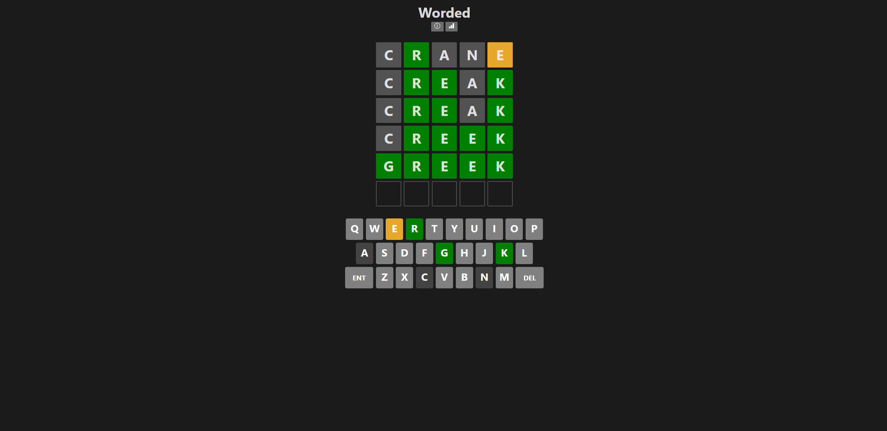
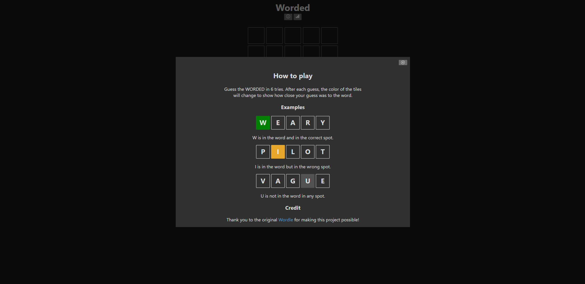
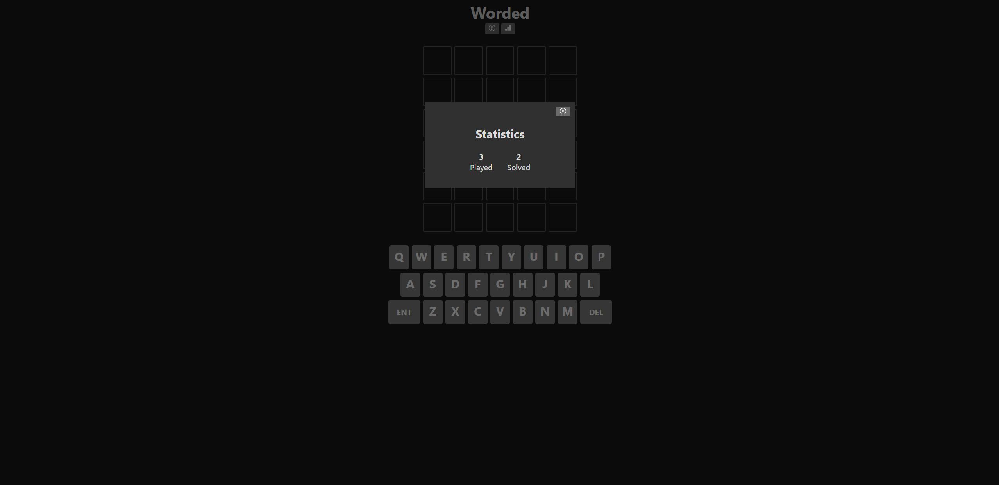

# Worded

### Important Links

[GitHub Repository](https://github.com/jnordan132/WordedWordleClone)\
[Netlify Live URL](https://wordedwordleclone.netlify.app/)\
[The Original Wordle Game](https://www.nytimes.com/games/wordle/index.html)

## Description

Worded is my version of [Wordle](https://www.nytimes.com/games/wordle/index.html). This "clone" was created using Vite's typescript template in React. Every time you refresh the site, a word for that game will be created, you have 6 attempts at solving the 5 letter word. Based on how many times you play the game, you will be given a stats menu that tracks the amount solved and the amount attempted to solve the game. Note: This application includes nearly 13,000 words, therefore, some games may be MUCH harder than others.

### Contact

If you find any bugs, or would like to reach out with questions. Feel free to send me an email: [jacob.nordan113322@gmail.com](mailto:jacob.nordan113322@gmail.com)

## Site Layout

